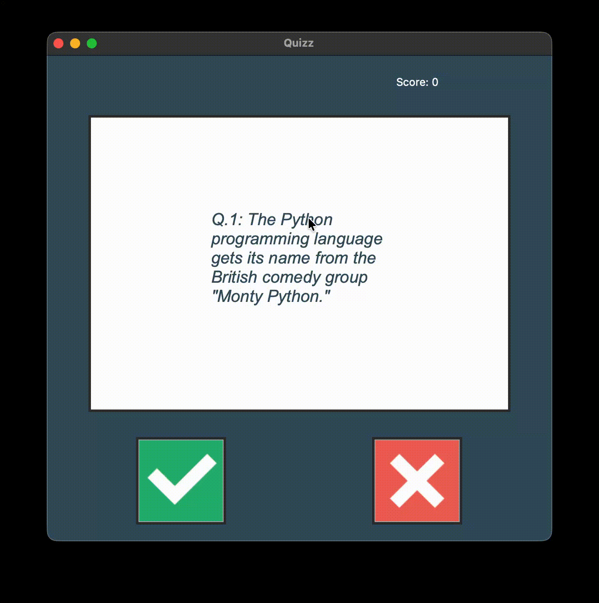

# Trivia Quiz Application with GUI

A sleek and interactive trivia quiz application built with Python and Tkinter. This app fetches live trivia questions from the Open Trivia Database API, challenging the user with a series of true or false questions in a clean, graphical interface.

The project is architected using Object-Oriented Programming (OOP) principles, with distinct classes for the user interface, quiz logic, and data modeling, making the codebase clean, modular, and easy to maintain.

## Live Demo



## Key Features

-   **Dynamic Questions:** Fetches 10 new true/false questions from the Open Trivia Database API every time the app is run, ensuring a unique quiz experience each session.
-   **Graphical User Interface:** A user-friendly and aesthetically pleasing interface built with Tkinter, providing a much better experience than a command-line quiz.
-   **Instant Visual Feedback:** The UI provides immediate feedback by turning the screen green for a correct answer and red for an incorrect one.
-   **Live Score Tracking:** The user's score is updated in real-time and displayed at the top of the window.
-   **Clean Architecture:** Follows OOP best practices by separating the UI (`ui.py`), the quiz logic (`quiz_brain.py`), the data model (`question_model.py`), and the API call (`data.py`).

## Project Setup

To run this application on your local machine, follow these steps.

### Prerequisites

-   Python 3.x
-   `pip` (Python package installer)

### Installation

1.  **Clone the repository:**
    ```bash
    git clone https://github.com/dheerajdhami2001-cyber/quizz_with_UI.git
    ```

2.  **Navigate into the project directory:**
    ```bash
    cd quizz_with_UI
    ```

3.  **Install the required dependency:**
    The project uses the `requests` library to fetch data from the API.
    ```bash
    pip install requests
    ```

4.  **Run the application:**
    ```bash
    python main.py
    ```

## How to Customize the Quiz

You can easily change the category of the trivia questions by modifying the API request.

1.  **Find the Category ID:**
    Go to the [Open Trivia Database API Categories page](https://opentdb.com/api_category.php) to find the list of all available categories and their corresponding ID numbers. For example:
    -   `17`: Science & Nature
    -   `18`: Science: Computers
    -   `21`: Sports
    -   `23`: History

2.  **Update the API Call:**
    -   Open the `data.py` file.
    -   Modify the `requests.get()` call to include a `params` dictionary with the desired category ID.

    **Example:** To get questions about "Science: Computers" (ID 18), change the code in `data.py` to this:

    ```python
    import requests

    parameters = {
        "amount": 10,
        "type": "boolean",
        "category": 18  # <--- Add this line with your chosen category ID
    }

    response = requests.get(url="https://opentdb.com/api.php", params=parameters)
    response.raise_for_status()
    data = response.json()

    question_data = data["results"]
    ```

## Code Structure

-   **`main.py`**: The entry point of the application. It initializes the question bank, the quiz logic, and the user interface.
-   **`data.py`**: Responsible for making the API call to the Open Trivia Database to fetch the quiz questions.
-   **`question_model.py`**: A simple class that defines the structure for a `Question` object.
-   **`quiz_brain.py`**: The "engine" of the quiz. It handles the core logic, such as tracking the score, fetching the next question, and verifying answers.
-   **`ui.py`**: Contains the `QuizInterface` class, which builds and manages the entire Tkinter graphical user interface.

## Acknowledgments

This project was inspired by and completed with the guidance of the **[100 Days of Code: The Complete Python Pro Bootcamp](https://www.udemy.com/course/100-days-of-code/)** by Dr. Angela Yu.
